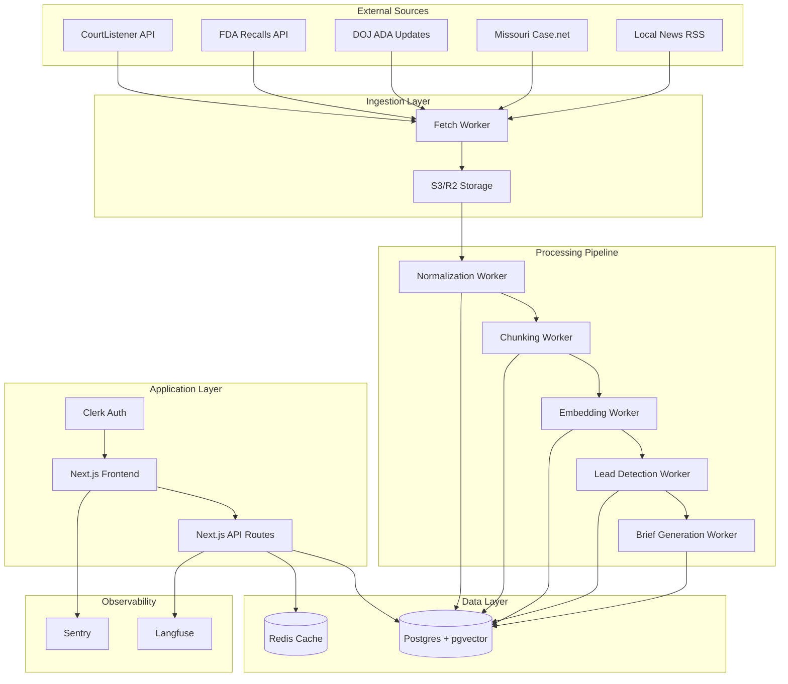

# Design Document

## Overview

The Legal Case Intelligence system is a multi-tenant SaaS platform that automatically discovers, processes, and ranks litigation opportunities for plaintiff law firms. The system ingests documents from various legal sources, processes them through an AI pipeline, and presents actionable leads through a modern web interface.

## Architecture

### Technology Stack
- **Frontend:** Next.js (App Router) + shadcn/ui + Tailwind + Clerk
- **Backend:** Next.js API routes / edge handlers
- **Database:** Postgres (Neon/Aurora) with RLS; `pgvector` for embeddings (MVP)
- **Vector Store:** Qdrant (managed) for future scaling when recall/latency require
- **Object Storage:** S3/R2 for raw artifacts; normalized text in Parquet for analytics
- **Analytics:** DuckDB/MotherDuck reading Parquet from S3
- **Pipelines:** Temporal (or Dagster) workers for ingestion → normalization → chunk → embed → candidate detect → brief
- **Queues/Cache:** Redis for rate control, idempotency, prompt/embedding cache
- **LLM Layer:** Hosted APIs (OpenAI/Anthropic) + reranker (Cohere or local bge-reranker)
- **Observability:** Langfuse (prompt tracing & guardrails), Sentry, OpenTelemetry

### System Architecture Diagram



## Components and Interfaces

### Data Models

#### Clerk Integration Strategy

The system uses Clerk for authentication and organization management with the following approach:

- **Organization Names:** Fetched dynamically from Clerk API, not stored in database
- **Organization IDs:** Clerk organization IDs used directly as primary keys
- **User Management:** Clerk handles user authentication and organization membership
- **Real-time Sync:** Organization names always reflect current Clerk settings

```typescript
// Organization name fetching
export async function getOrganizationName(): Promise<string | null> {
  const { orgId } = await auth();
  const client = await clerkClient();
  const organization = await client.organizations.getOrganization({ organizationId: orgId });
  return organization.name;
}
```

#### Core Tables
```sql
-- Organization and user management
-- Note: Organization name is fetched from Clerk API, not stored in database
CREATE TABLE organization (
    id TEXT PRIMARY KEY, -- Use Clerk org ID directly (e.g., "org_31owG6R7MT3GfUxcYFIB9HqMHji")
    region TEXT DEFAULT '',
    website TEXT,
    timezone TEXT DEFAULT 'America/Chicago',
    practice_areas TEXT[] DEFAULT '{}',
    jurisdictions TEXT[] DEFAULT '{}',
    keywords_include TEXT[] DEFAULT '{}',
    keywords_exclude TEXT[] DEFAULT '{}',
    -- Source configuration
    source_courtlistener BOOLEAN DEFAULT true,
    source_openfda BOOLEAN DEFAULT true,
    source_doj BOOLEAN DEFAULT true,
    source_rss BOOLEAN DEFAULT false,
    -- Digest settings
    digest_enabled BOOLEAN DEFAULT true,
    digest_cadence TEXT DEFAULT 'weekly' CHECK (digest_cadence IN ('daily', 'weekly')),
    digest_hour_local INTEGER DEFAULT 9 CHECK (digest_hour_local >= 0 AND digest_hour_local <= 23),
    -- Billing
    billing TEXT DEFAULT 'trial' CHECK (billing IN ('trial', 'active', 'past_due')),
    trial_ends_at TIMESTAMPTZ,
    created_at TIMESTAMPTZ DEFAULT NOW(),
    updated_at TIMESTAMPTZ DEFAULT NOW()
);

CREATE TABLE org_user (
    org_id TEXT REFERENCES organization(id) ON DELETE CASCADE,
    user_id TEXT NOT NULL, -- Clerk user ID
    role TEXT NOT NULL CHECK (role IN ('admin', 'attorney', 'analyst')),
    created_at TIMESTAMPTZ DEFAULT NOW(),
    PRIMARY KEY (org_id, user_id)
);

-- Practice area configuration
CREATE TABLE practice_area (
    id UUID PRIMARY KEY DEFAULT uuid_generate_v4(),
    org_id TEXT REFERENCES organization(id) ON DELETE CASCADE,
    name TEXT NOT NULL,
    keywords TEXT[] DEFAULT '{}',
    enabled BOOLEAN DEFAULT true,
    created_at TIMESTAMPTZ DEFAULT NOW()
);

-- Document storage and processing
CREATE TABLE document (
    id UUID PRIMARY KEY DEFAULT gen_random_uuid(),
    org_id UUID REFERENCES organization(id),
    source TEXT NOT NULL,
    source_ref TEXT NOT NULL,
    object_key TEXT NOT NULL,
    mime_type TEXT,
    hash TEXT NOT NULL,
    ingested_at TIMESTAMPTZ DEFAULT NOW(),
    processed_at TIMESTAMPTZ
);

CREATE TABLE doc_text (
    id UUID PRIMARY KEY DEFAULT gen_random_uuid(),
    org_id UUID REFERENCES organization(id),
    document_id UUID REFERENCES document(id),
    version INTEGER DEFAULT 1,
    text TEXT NOT NULL,
    token_count INTEGER
);

CREATE TABLE chunk (
    id UUID PRIMARY KEY DEFAULT gen_random_uuid(),
    org_id UUID REFERENCES organization(id),
    document_id UUID REFERENCES document(id),
    idx INTEGER NOT NULL,
    text TEXT NOT NULL,
    tokens INTEGER,
    meta JSONB
);

-- Vector embeddings
CREATE TABLE embedding (
    id UUID PRIMARY KEY DEFAULT gen_random_uuid(),
    org_id UUID REFERENCES organization(id),
    chunk_id UUID REFERENCES chunk(id),
    vector vector(1536), -- pgvector extension
    model TEXT NOT NULL,
    created_at TIMESTAMPTZ DEFAULT NOW()
);

-- Lead management
CREATE TABLE lead (
    id UUID PRIMARY KEY DEFAULT gen_random_uuid(),
    org_id UUID REFERENCES organization(id),
    practice_area_id UUID REFERENCES practice_area(id),
    title TEXT NOT NULL,
    summary TEXT,
    confidence DECIMAL(3,2) CHECK (confidence >= 0 AND confidence <= 1),
    jurisdiction TEXT,
    source_ids UUID[],
    created_at TIMESTAMPTZ DEFAULT NOW(),
    status TEXT DEFAULT 'new' CHECK (status IN ('new', 'reviewed', 'contacted', 'dismissed'))
);

-- User feedback and observability
CREATE TABLE feedback (
    id UUID PRIMARY KEY DEFAULT gen_random_uuid(),
    org_id UUID REFERENCES organization(id),
    lead_id UUID REFERENCES lead(id),
    user_id TEXT NOT NULL,
    label TEXT CHECK (label IN ('useful', 'not_useful')),
    note TEXT,
    created_at TIMESTAMPTZ DEFAULT NOW()
);

CREATE TABLE prompt_run (
    id UUID PRIMARY KEY DEFAULT gen_random_uuid(),
    org_id UUID REFERENCES organization(id),
    user_id TEXT,
    model TEXT NOT NULL,
    input_tokens INTEGER,
    output_tokens INTEGER,
    cost_usd DECIMAL(10,6),
    created_at TIMESTAMPTZ DEFAULT NOW()
);
```

#### Row Level Security (RLS) Implementation
```sql
-- Enable RLS on all tenant tables
ALTER TABLE organization ENABLE ROW LEVEL SECURITY;
ALTER TABLE org_user ENABLE ROW LEVEL SECURITY;
ALTER TABLE practice_area ENABLE ROW LEVEL SECURITY;
ALTER TABLE document ENABLE ROW LEVEL SECURITY;
ALTER TABLE doc_text ENABLE ROW LEVEL SECURITY;
ALTER TABLE chunk ENABLE ROW LEVEL SECURITY;
ALTER TABLE embedding ENABLE ROW LEVEL SECURITY;
ALTER TABLE lead ENABLE ROW LEVEL SECURITY;
ALTER TABLE feedback ENABLE ROW LEVEL SECURITY;
ALTER TABLE prompt_run ENABLE ROW LEVEL SECURITY;

-- Create policies for tenant isolation
CREATE POLICY org_isolation ON organization 
    USING (id = current_setting('app.org_id', true)::uuid);

CREATE POLICY org_user_isolation ON org_user 
    USING (org_id = current_setting('app.org_id', true)::uuid);

-- Similar policies for all other tables...
```

### API Interface Design

#### Authentication Middleware
```typescript
// middleware.ts
export async function middleware(request: NextRequest) {
  const { userId, orgId } = auth();
  
  if (!userId) {
    return redirectToSignIn();
  }
  
  // Set org context for RLS
  if (orgId) {
    request.headers.set('x-org-id', orgId);
  }
  
  return NextResponse.next();
}
```

#### Core API Routes
- `GET /api/leads` - List leads with filtering
- `GET /api/leads/[id]` - Get lead details with sources
- `POST /api/leads/[id]/feedback` - Submit lead feedback
- `GET /api/sources` - List available sources and their status
- `POST /api/pipeline/run` - Trigger manual pipeline run
- `GET /api/admin/settings` - Get organization settings
- `PUT /api/admin/settings` - Update organization settings
- `GET /api/admin/costs` - Get cost analytics

## Data Models

### Source Integration Models

#### CourtListener Integration
```typescript
interface CourtListenerDocument {
  id: string;
  court: string;
  docket_number: string;
  date_filed: string;
  download_url: string;
  plain_text?: string;
}
```

#### FDA Recalls Integration
```typescript
interface FDARecall {
  recall_number: string;
  product_description: string;
  reason_for_recall: string;
  recall_initiation_date: string;
  firm_fei_number: string;
  city: string;
  state: string;
}
```

### Processing Pipeline Models

#### Lead Scoring Model
```typescript
interface LeadScore {
  sourceAuthority: number; // 0-0.3
  recencyVelocity: number; // 0-0.25
  localRelevance: number; // 0-0.25
  practiceAreaMatch: number; // 0-0.2
  totalConfidence: number; // 0-1
}
```

#### Brief Generation Model
```typescript
interface LeadBrief {
  whatHappened: string;
  partiesStatutes: string;
  jurisdictionTiming: string;
  whyFitsUs: string;
  nextSteps: string;
  citations: Citation[];
}

interface Citation {
  chunkId: string;
  documentId: string;
  pageAnchor?: string;
  sourceUrl?: string;
}
```

## Error Handling

### Pipeline Error Recovery
- **Transient Failures:** Exponential backoff with jitter (2^n * 100ms + random)
- **Rate Limiting:** Redis-based token bucket with per-source limits
- **Data Corruption:** Checksum validation and automatic re-processing
- **External API Failures:** Circuit breaker pattern with fallback to cached data

### User-Facing Error Handling
- **Authentication Errors:** Redirect to Clerk sign-in with return URL
- **Authorization Errors:** 403 with clear message about org access
- **Validation Errors:** Field-level validation with user-friendly messages
- **System Errors:** Generic error page with incident ID for support

## Testing Strategy

### Unit Testing
- **Data Models:** Validation logic, RLS policies, scoring algorithms
- **API Routes:** Request/response handling, authentication, authorization
- **Pipeline Workers:** Document processing, embedding generation, lead detection
- **Frontend Components:** User interactions, state management, error handling

### Integration Testing
- **Database:** Multi-tenant data isolation, performance under load
- **External APIs:** Mock responses, rate limiting, error scenarios
- **Pipeline End-to-End:** Full document ingestion to lead generation
- **Authentication:** Clerk integration, session management

### Performance Testing
- **Load Testing:** Concurrent users, API response times, database queries
- **Pipeline Performance:** Document processing throughput, embedding generation speed
- **Cost Optimization:** Token usage monitoring, caching effectiveness

### Security Testing
- **RLS Verification:** Cross-tenant data access prevention
- **Input Validation:** SQL injection, XSS prevention
- **Authentication:** Session hijacking, privilege escalation
- **Data Encryption:** At-rest and in-transit encryption verification

## Deployment and Scaling Considerations

### MVP Deployment
- **Hosting:** Vercel for Next.js application
- **Database:** Neon Postgres with pgvector extension
- **Storage:** AWS S3 or Cloudflare R2
- **Cache:** Upstash Redis
- **Monitoring:** Vercel Analytics + Sentry

### Future Scaling
- **Vector Database:** Migration to Qdrant for improved performance
- **Pipeline Workers:** Separate deployment on Railway or Fly.io
- **CDN:** Cloudflare for static assets and API caching
- **Database:** Read replicas for analytics queries