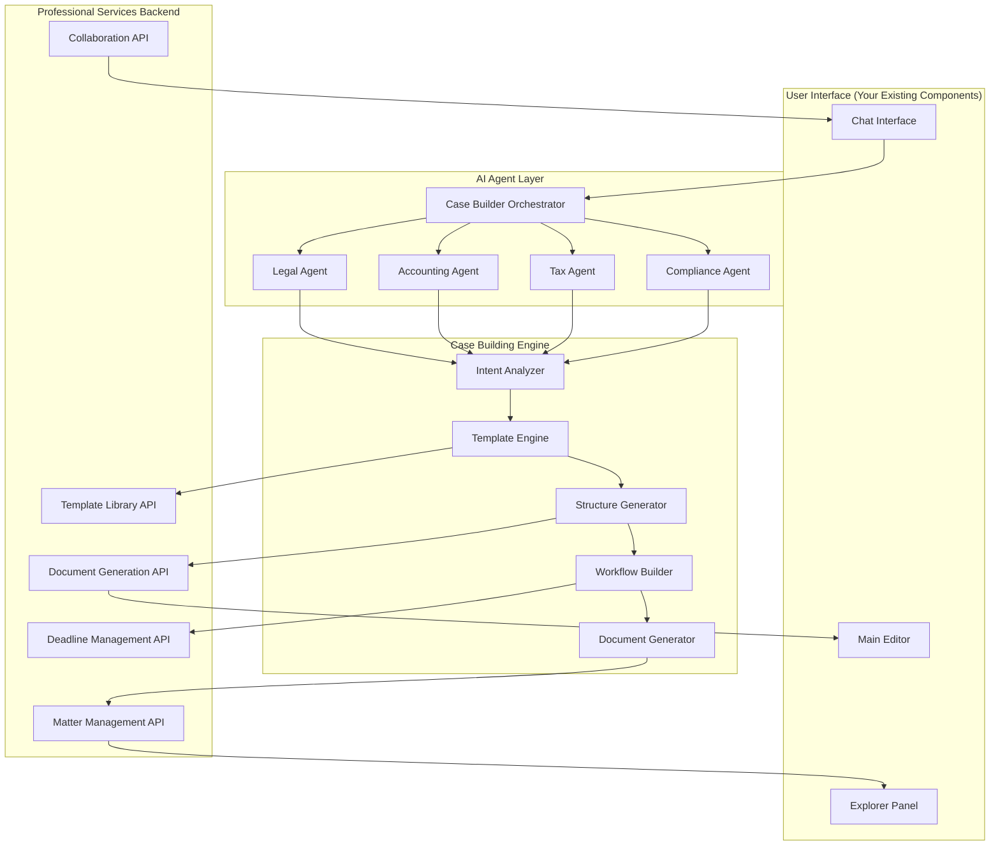
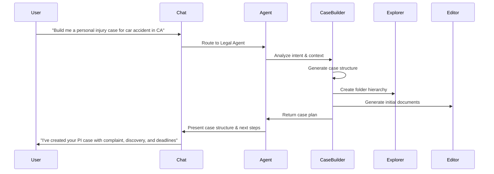
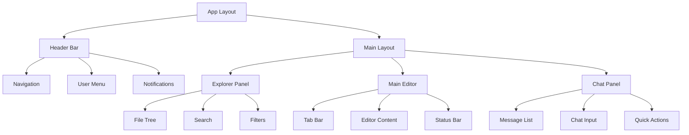

# Province Cursor Frontend Design Document

## Overview

Province Cursor transforms the familiar Cursor IDE interface into a powerful professional services workspace for law, accounting, tax, and compliance professionals. The core innovation is **chat-driven case building** - users can describe their legal case, accounting project, tax situation, or compliance requirement in natural language, and the AI will guide them through building the complete matter structure with all necessary documents, deadlines, and workflows.

The design centers around three enhanced UI components you've already built:
- **Explorer Panel**: Intelligent matter/case navigator with AI-generated folder structures
- **Main Editor**: Professional document editor with domain-specific intelligence  
- **Chat Interface**: Conversational AI that builds entire cases and guides professional workflows

The system transforms complex professional processes into natural conversations: "Build me a personal injury case for a car accident in California" → Complete case structure with all documents, deadlines, and workflows automatically generated.

## Architecture

### Chat-Driven Case Building Architecture



### Conversational Case Building Flow



### Component Hierarchy



## Core Components Enhancement

### 1. Enhanced Explorer Panel (AI-Generated Matter Structure)

**Purpose**: Displays AI-generated case/matter structures with intelligent organization and contextual actions.

**Chat-Driven Features**:
- **Auto-Generated Hierarchies**: AI creates complete folder structures based on chat descriptions
- **Smart Matter Templates**: Practice area-specific templates applied automatically
- **Contextual Quick Actions**: Right-click menus with AI-suggested next steps
- **Visual Progress Indicators**: Shows case completion status and upcoming deadlines
- **Intelligent Grouping**: Matters organized by urgency, client, or practice area

**Component Structure**:
```typescript
interface EnhancedExplorerProps {
  matters: AIMatter[];
  currentMatter?: AIMatter;
  onMatterSelect: (matter: AIMatter) => void;
  onAIAction: (action: AIAction) => void;
  onChatRequest: (request: string) => void;
}

interface AIMatter {
  id: string;
  name: string;
  type: MatterType; // 'personal-injury' | 'corporate-tax' | 'audit' | 'compliance'
  practiceArea: PracticeArea;
  aiGenerated: boolean;
  structure: MatterStructure;
  progress: MatterProgress;
  deadlines: AIDeadline[];
  suggestedActions: AIAction[];
  chatContext: ChatContext;
}

interface MatterStructure {
  folders: AIFolder[];
  documents: AIDocument[];
  workflows: AIWorkflow[];
  templates: AITemplate[];
}

interface AIFolder {
  id: string;
  name: string;
  purpose: string; // AI explanation of folder purpose
  requiredDocuments: string[];
  suggestedTemplates: string[];
  children: AIFolder[];
}
```

**AI-Enhanced Explorer Features**:
```typescript
// Example: Personal Injury Case Structure (AI-Generated)
const personalInjuryCaseStructure = {
  name: "Smith v. ABC Insurance - Car Accident",
  folders: [
    {
      name: "01-Pleadings",
      purpose: "Initial court filings and responses",
      requiredDocuments: ["Complaint", "Answer", "Cross-Complaint"],
      suggestedTemplates: ["CA Personal Injury Complaint Template"]
    },
    {
      name: "02-Discovery", 
      purpose: "Information gathering phase",
      requiredDocuments: ["Interrogatories", "Document Requests", "Depositions"],
      suggestedTemplates: ["Standard PI Discovery Set"]
    },
    {
      name: "03-Medical Records",
      purpose: "Client medical documentation",
      requiredDocuments: ["Hospital Records", "Doctor Reports", "Bills"],
      suggestedTemplates: ["Medical Records Request Letter"]
    },
    {
      name: "04-Expert Witnesses",
      purpose: "Expert testimony and reports", 
      requiredDocuments: ["Expert Reports", "CV", "Fee Agreements"],
      suggestedTemplates: ["Expert Witness Retention Agreement"]
    }
  ]
};
```

### 2. Enhanced Main Editor (AI-Powered Document Creation)

**Purpose**: Professional document editor that creates and edits documents through AI conversation.

**Chat-Driven Features**:
- **Conversational Document Creation**: "Draft a motion to dismiss for lack of jurisdiction"
- **AI-Guided Editing**: Inline suggestions and improvements as you type
- **Smart Templates**: AI selects and customizes templates based on context
- **Professional Formatting**: Automatic citation, numbering, and legal formatting
- **Cross-Document Intelligence**: AI maintains consistency across related documents

**Component Structure**:
```typescript
interface AIMainEditorProps {
  documents: AIDocument[];
  activeDocumentId?: string;
  currentMatter: AIMatter;
  onAIGenerate: (prompt: string) => void;
  onAIEdit: (selection: string, instruction: string) => void;
  onDocumentSave: (doc: AIDocument) => void;
}

interface AIDocument {
  id: string;
  name: string;
  type: ProfessionalDocumentType;
  content: string;
  aiGenerated: boolean;
  aiContext: AIDocumentContext;
  templates: AppliedTemplate[];
  citations: AutoCitation[];
  calculations: AutoCalculation[];
  collaborators: Collaborator[];
  reviewStatus: ReviewStatus;
}

interface AIDocumentContext {
  matterId: string;
  practiceArea: PracticeArea;
  jurisdiction: string;
  relatedDocuments: string[];
  aiPrompt: string; // Original chat prompt that created this document
  aiReasoning: string; // AI explanation of document structure
  suggestedEdits: AISuggestion[];
}

type ProfessionalDocumentType = 
  | 'legal-complaint' | 'legal-motion' | 'legal-contract' | 'legal-brief'
  | 'tax-return' | 'tax-memo' | 'tax-planning'
  | 'financial-statement' | 'audit-report' | 'management-letter'
  | 'compliance-report' | 'policy-document' | 'audit-checklist';
```

**AI Document Generation Examples**:
```typescript
// Legal Document Generation
const legalPrompts = {
  "Draft a motion to dismiss for lack of personal jurisdiction": {
    template: "motion-to-dismiss-template",
    jurisdiction: "california",
    autoSections: ["caption", "introduction", "statement-of-facts", "argument", "conclusion"],
    citations: ["auto-cite-relevant-cases"],
    formatting: "california-court-rules"
  },
  
  "Create a non-disclosure agreement for tech startup": {
    template: "nda-template",
    industry: "technology", 
    autoSections: ["parties", "confidential-info", "obligations", "term", "remedies"],
    clauses: ["mutual-nda", "residual-info", "return-of-materials"],
    jurisdiction: "delaware"
  }
};

// Tax Document Generation  
const taxPrompts = {
  "Prepare Form 1120 for S-Corp with international operations": {
    template: "form-1120s-template",
    complexity: "international",
    autoSections: ["income", "deductions", "foreign-operations", "schedules"],
    calculations: ["auto-calculate-tax", "foreign-tax-credit"],
    compliance: ["check-international-reporting"]
  }
};
```

### 3. Enhanced Chat Interface (Case Building Command Center)

**Purpose**: The primary interface for building entire cases, matters, and professional workflows through natural conversation.

**Chat-Driven Case Building Features**:
- **Complete Case Generation**: "Build me a personal injury case" → Full case structure created
- **Guided Workflows**: AI walks through complex processes step-by-step  
- **Contextual Intelligence**: Remembers case details and provides relevant suggestions
- **Action Buttons**: Execute common tasks directly from chat (create document, set deadline, etc.)
- **Multi-Agent Routing**: Automatically routes to legal, tax, accounting, or compliance specialists

**Component Structure**:
```typescript
interface AIChatPanelProps {
  currentMatter?: AIMatter;
  practiceArea: PracticeArea;
  onCaseBuild: (caseDescription: string) => void;
  onDocumentGenerate: (prompt: string) => void;
  onWorkflowStart: (workflow: AIWorkflow) => void;
  onQuickAction: (action: QuickAction) => void;
}

interface AIChatMessage {
  id: string;
  type: 'user' | 'agent' | 'system';
  content: string;
  timestamp: Date;
  agent: AIAgent;
  
  // Case Building Features
  caseStructure?: GeneratedCaseStructure;
  documents?: GeneratedDocument[];
  workflows?: AIWorkflow[];
  deadlines?: AIDeadline[];
  
  // Interactive Elements
  quickActions?: QuickAction[];
  followUpQuestions?: string[];
  citations?: AutoCitation[];
  attachments?: Attachment[];
  
  // Context
  matterId?: string;
  relatedMessages?: string[];
  confidence?: number;
}

interface AIAgent {
  type: 'legal' | 'accounting' | 'tax' | 'compliance' | 'orchestrator';
  name: string;
  specialization: string[];
  avatar: string;
  status: 'active' | 'thinking' | 'researching' | 'generating';
}

interface GeneratedCaseStructure {
  name: string;
  type: string;
  folders: AIFolder[];
  initialDocuments: string[];
  keyDeadlines: AIDeadline[];
  suggestedWorkflow: AIWorkflow;
  estimatedTimeline: string;
  reasoning: string; // AI explanation of structure choices
}
```

**Conversational Case Building Examples**:
```typescript
// Legal Case Building
const legalCaseExamples = {
  userInput: "Build me a personal injury case for a car accident in California",
  aiResponse: {
    caseStructure: {
      name: "Personal Injury - Motor Vehicle Accident",
      type: "personal-injury-auto",
      folders: ["Pleadings", "Discovery", "Medical Records", "Expert Witnesses", "Settlement"],
      initialDocuments: [
        "Client Intake Questionnaire",
        "Retainer Agreement", 
        "Complaint Template",
        "Medical Records Request"
      ],
      keyDeadlines: [
        { task: "File Complaint", dueDate: "within 2 years of accident", priority: "high" },
        { task: "Serve Defendant", dueDate: "within 60 days of filing", priority: "high" }
      ],
      reasoning: "Created standard PI auto case structure based on CA civil procedure rules"
    },
    quickActions: [
      { label: "Draft Complaint", action: "generate-complaint" },
      { label: "Create Client Intake", action: "generate-intake-form" },
      { label: "Set Statute Deadline", action: "calculate-statute-limitations" },
      { label: "Research Similar Cases", action: "legal-research" }
    ]
  }
};

// Tax Case Building
const taxCaseExamples = {
  userInput: "Help me prepare a corporate tax return for an S-Corp with international operations",
  aiResponse: {
    caseStructure: {
      name: "S-Corp Tax Return - International Operations",
      type: "tax-return-s-corp-international",
      folders: ["Tax Returns", "Supporting Schedules", "International Forms", "Documentation"],
      initialDocuments: [
        "Form 1120S",
        "Schedule K-1s",
        "Form 8865 (Foreign Partnerships)",
        "Form 5471 (Foreign Corporations)"
      ],
      keyDeadlines: [
        { task: "File Form 1120S", dueDate: "March 15, 2024", priority: "high" },
        { task: "Distribute K-1s", dueDate: "March 15, 2024", priority: "high" }
      ],
      reasoning: "S-Corp with international ops requires additional forms for foreign entity reporting"
    },
    quickActions: [
      { label: "Start Form 1120S", action: "generate-1120s" },
      { label: "Calculate Foreign Tax Credit", action: "calculate-ftc" },
      { label: "Check International Compliance", action: "international-compliance-check" },
      { label: "Generate K-1 Worksheets", action: "generate-k1-worksheets" }
    ]
  }
};
```

**Chat Interface Features**:
```typescript
interface ChatFeatures {
  // Case Building Commands
  caseBuilding: {
    "build [case type]": "Generate complete case structure",
    "create [document type]": "Generate specific document", 
    "set up [workflow]": "Initialize practice area workflow",
    "what's next for [matter]": "Get next steps guidance"
  };
  
  // Quick Actions
  quickActions: {
    generateDocument: (type: string, context: any) => void;
    setDeadline: (task: string, date: Date) => void;
    startWorkflow: (workflow: AIWorkflow) => void;
    researchTopic: (topic: string, jurisdiction?: string) => void;
    calculateDeadline: (event: string, jurisdiction: string) => void;
  };
  
  // Context Awareness
  contextFeatures: {
    rememberMatterDetails: boolean;
    trackConversationHistory: boolean;
    suggestRelatedActions: boolean;
    maintainCaseTimeline: boolean;
  };
}

## Conversational Case Building System

### Core Case Building Engine

The heart of Province Cursor is the **Conversational Case Building Engine** that transforms natural language descriptions into complete professional matter structures.

```typescript
interface CaseBuildingEngine {
  // Main case building function
  buildCase(description: string, practiceArea: PracticeArea): Promise<GeneratedCase>;
  
  // Guided workflow functions
  startGuidedWorkflow(workflowType: string): Promise<GuidedWorkflow>;
  continueWorkflow(workflowId: string, userInput: string): Promise<WorkflowStep>;
  
  // Document generation
  generateDocument(prompt: string, context: CaseContext): Promise<AIDocument>;
  
  // Intelligence functions
  suggestNextSteps(matterId: string): Promise<NextStep[]>;
  analyzeCase(matterId: string): Promise<CaseAnalysis>;
}

interface GeneratedCase {
  structure: CaseStructure;
  documents: AIDocument[];
  workflows: AIWorkflow[];
  deadlines: AIDeadline[];
  timeline: CaseTimeline;
  reasoning: string;
}
```

### Conversational Patterns

**Case Initiation Patterns**:
```typescript
const caseInitiationPatterns = {
  // Legal Cases
  "Build me a [case type] case for [situation]": "personal injury case for car accident",
  "I need to [legal action] for [client situation]": "file a motion to dismiss for lack of jurisdiction", 
  "Help me with [legal matter] in [jurisdiction]": "contract dispute in California",
  
  // Accounting/Tax Cases  
  "Prepare [tax form] for [entity type] with [complexity]": "Form 1120 for C-Corp with international operations",
  "Set up [accounting process] for [client type]": "month-end close for manufacturing client",
  "I need to [compliance task] for [regulation]": "prepare SOX compliance documentation",
  
  // Guided Workflows
  "Walk me through [process]": "filing a trademark application",
  "What are the steps for [procedure]": "conducting a financial statement audit",
  "Guide me through [compliance requirement]": "GDPR compliance assessment"
};
```

**AI Response Patterns**:
```typescript
interface AIResponsePattern {
  // Case Structure Presentation
  caseOverview: {
    summary: string;
    keyComponents: string[];
    timeline: string;
    complexity: 'simple' | 'moderate' | 'complex';
  };
  
  // Interactive Elements
  quickActions: QuickAction[];
  followUpQuestions: string[];
  suggestedDocuments: string[];
  
  // Guidance
  nextSteps: NextStep[];
  warnings: ComplianceWarning[];
  tips: ProfessionalTip[];
}
```

### Practice Area Specializations

### Legal Practice Interface

**Conversational Case Building Examples**:
```typescript
// Personal Injury Case
"Build me a personal injury case for a car accident in California"
→ Creates: Complaint, Discovery, Medical Records, Expert Witnesses folders
→ Generates: Client intake, retainer agreement, complaint template
→ Sets: Statute of limitations deadline, discovery deadlines
→ Provides: CA-specific procedural guidance

// Contract Dispute  
"I have a breach of contract case - software licensing dispute"
→ Creates: Pleadings, Discovery, Contract Analysis, Damages folders
→ Generates: Complaint for breach, contract review memo
→ Sets: Answer deadline, discovery cutoff dates
→ Provides: Contract law research, damages calculation tools

// Corporate Transaction
"Help me with a merger and acquisition deal"
→ Creates: Due Diligence, Agreements, Regulatory, Closing folders  
→ Generates: LOI template, due diligence checklist, purchase agreement
→ Sets: Due diligence deadlines, regulatory filing dates
→ Provides: M&A workflow guidance, regulatory compliance checks
```

**AI Agent Specializations**:
- **Litigation Agent**: Case strategy, pleadings, discovery, trial prep
- **Transactional Agent**: Contracts, M&A, corporate governance
- **Research Agent**: Case law, statutes, regulations, precedents
- **Compliance Agent**: Ethics rules, court procedures, filing requirements
- **Citation Agent**: Bluebook formatting, case validation, legal writing

### Accounting Practice Interface

**Conversational Case Building Examples**:
```typescript
// Financial Statement Audit
"Set up an audit for a manufacturing company with $50M revenue"
→ Creates: Planning, Fieldwork, Reporting, Management Letter folders
→ Generates: Audit program, risk assessment, planning memo
→ Sets: Interim testing dates, year-end fieldwork, report deadline
→ Provides: Manufacturing industry audit procedures, materiality calculations

// Month-End Close Process
"Help me set up month-end close procedures for a SaaS company"
→ Creates: Journal Entries, Reconciliations, Reports, Analysis folders
→ Generates: Close checklist, reconciliation templates, variance analysis
→ Sets: Close calendar with daily tasks and deadlines
→ Provides: SaaS-specific revenue recognition guidance, KPI dashboards

// Financial Statement Preparation  
"Prepare financial statements for a nonprofit organization"
→ Creates: Statements, Notes, Supplementary, Board Package folders
→ Generates: Statement of activities, functional expenses, cash flows
→ Sets: Board meeting deadline, filing requirements
→ Provides: Nonprofit accounting standards, donor restriction tracking
```

**AI Agent Specializations**:
- **Audit Agent**: Risk assessment, testing procedures, audit opinions
- **Financial Reporting Agent**: GAAP compliance, statement preparation, disclosures  
- **Management Agent**: Budgeting, forecasting, variance analysis, KPIs
- **Advisory Agent**: Process improvement, internal controls, business consulting
- **Compliance Agent**: Regulatory reporting, industry standards, quality control

### Tax Practice Interface

**Conversational Case Building Examples**:
```typescript
// Corporate Tax Return
"Prepare Form 1120 for a C-Corp with international subsidiaries"
→ Creates: Returns, Schedules, International Forms, Supporting Docs folders
→ Generates: Form 1120, Schedule M-3, Form 5471, transfer pricing docs
→ Sets: Filing deadline, extension dates, estimated payment dates
→ Provides: International tax compliance, transfer pricing guidance

// Individual Tax Planning
"Help with tax planning for a high-net-worth client selling their business"
→ Creates: Planning, Projections, Strategies, Documentation folders
→ Generates: Tax projection models, installment sale analysis, estate planning memo
→ Sets: Year-end planning deadlines, estimated payment dates
→ Provides: Capital gains strategies, succession planning options

// Multi-State Tax Compliance
"Set up state tax compliance for a company expanding to 5 new states"
→ Creates: State Returns, Registrations, Apportionment, Nexus Analysis folders
→ Generates: Nexus studies, apportionment worksheets, registration forms
→ Sets: Registration deadlines, filing due dates by state
→ Provides: State-specific requirements, nexus thresholds, compliance calendars
```

**AI Agent Specializations**:
- **Return Preparation Agent**: Form completion, calculations, compliance checks
- **Planning Agent**: Tax strategies, projections, optimization opportunities
- **Research Agent**: Tax law, regulations, rulings, case law analysis
- **International Agent**: Foreign compliance, treaties, transfer pricing
- **State & Local Agent**: Multi-state issues, nexus, apportionment, local taxes

### Compliance Practice Interface

**Conversational Case Building Examples**:
```typescript
// SOX Compliance Program
"Set up SOX compliance for a newly public company"
→ Creates: Controls, Testing, Documentation, Reporting folders
→ Generates: Control matrices, testing procedures, deficiency tracking
→ Sets: Quarterly testing cycles, management certification deadlines
→ Provides: SOX 404 guidance, PCAOB standards, remediation procedures

// GDPR Compliance Assessment
"Help me conduct a GDPR compliance assessment for our EU operations"
→ Creates: Assessment, Policies, Procedures, Training folders
→ Generates: Data mapping questionnaires, privacy policies, consent forms
→ Sets: Assessment timeline, policy review dates, training schedules
→ Provides: GDPR requirements, data protection impact assessments

// Financial Services Compliance
"Create a compliance program for a new fintech startup"
→ Creates: Regulations, Policies, Monitoring, Reporting folders
→ Generates: Compliance manual, AML procedures, risk assessments
→ Sets: Regulatory filing deadlines, audit schedules, training requirements
→ Provides: Fintech regulations, licensing requirements, ongoing obligations
```

**AI Agent Specializations**:
- **Regulatory Agent**: Rule interpretation, requirement analysis, change monitoring
- **Risk Agent**: Risk assessment, control design, testing procedures
- **Audit Agent**: Audit preparation, finding remediation, management reporting
- **Policy Agent**: Policy development, procedure documentation, training materials
- **Monitoring Agent**: Ongoing compliance, exception tracking, reporting dashboards

## Chat-Driven UI Integration

### Seamless Integration with Existing Components

Your existing UI components (Explorer Panel, Main Editor, Chat) will be enhanced to work together seamlessly in the case building process:

```typescript
// Integration Flow Example
interface CaseBuildingFlow {
  // 1. User chats with AI
  chatInput: "Build me a personal injury case for car accident in CA";
  
  // 2. AI analyzes and responds
  aiResponse: {
    caseStructure: GeneratedCaseStructure;
    quickActions: QuickAction[];
    explanation: string;
  };
  
  // 3. Explorer Panel updates automatically
  explorerUpdate: {
    newMatter: AIMatter;
    folderStructure: AIFolder[];
    visualIndicators: StatusIndicator[];
  };
  
  // 4. Main Editor opens generated documents
  editorUpdate: {
    newTabs: AIDocument[];
    activeDocument: string;
    aiSuggestions: AISuggestion[];
  };
  
  // 5. Chat provides next steps
  followUp: {
    suggestedActions: string[];
    guidanceMessages: string[];
    quickActionButtons: QuickAction[];
  };
}
```

### Real-Time UI Synchronization

```typescript
interface UISync {
  // Chat → Explorer synchronization
  onCaseGenerated: (caseStructure: GeneratedCaseStructure) => {
    // Update explorer tree
    explorerPanel.addMatter(caseStructure.matter);
    explorerPanel.expandFolders(caseStructure.folders);
    explorerPanel.highlightNewItems();
  };
  
  // Chat → Editor synchronization  
  onDocumentGenerated: (document: AIDocument) => {
    // Open in editor
    mainEditor.openDocument(document);
    mainEditor.showAIContext(document.aiContext);
    mainEditor.enableAIAssist();
  };
  
  // Explorer → Chat synchronization
  onExplorerAction: (action: ExplorerAction) => {
    // Update chat context
    chatPanel.updateContext(action.context);
    chatPanel.suggestRelatedActions(action.type);
  };
  
  // Editor → Chat synchronization
  onEditorChange: (change: EditorChange) => {
    // Provide contextual assistance
    chatPanel.offerEditingSuggestions(change);
    chatPanel.validateContent(change.content);
  };
}
```

### Progressive Enhancement Strategy

Your existing components will be progressively enhanced with AI capabilities:

```typescript
// Phase 1: Basic AI Integration
interface BasicAIEnhancement {
  explorerPanel: {
    addAIActions: () => void; // Right-click AI options
    showAIStatus: () => void; // AI-generated indicators
  };
  
  mainEditor: {
    addAIAssist: () => void; // Inline AI suggestions
    enableSmartComplete: () => void; // Context-aware autocomplete
  };
  
  chatPanel: {
    addCaseBuilding: () => void; // Case building commands
    enableQuickActions: () => void; // Action buttons
  };
}

// Phase 2: Advanced AI Features
interface AdvancedAIEnhancement {
  explorerPanel: {
    enableSmartOrganization: () => void; // AI-driven folder structures
    addPredictiveActions: () => void; // Suggested next steps
  };
  
  mainEditor: {
    enableCollaborativeAI: () => void; // Real-time AI collaboration
    addDocumentIntelligence: () => void; // Cross-document awareness
  };
  
  chatPanel: {
    enableWorkflowGuidance: () => void; // Step-by-step guidance
    addContextualMemory: () => void; // Conversation history
  };
}
```

## State Management

### Enhanced Application State Structure (AI-Driven)

```typescript
interface AppState {
  user: UserState;
  workspace: AIWorkspaceState;
  documents: AIDocumentState;
  chat: AIChatState;
  caseBuilding: CaseBuildingState;
  ui: UIState;
}

interface UserState {
  profile: UserProfile;
  preferences: UserPreferences;
  practiceAreas: PracticeArea[];
  permissions: Permission[];
  aiSettings: AIUserSettings;
}

interface AIWorkspaceState {
  currentMatter?: AIMatter;
  matters: AIMatter[];
  aiTemplates: AITemplate[];
  generatedStructures: GeneratedCaseStructure[];
  deadlines: AIDeadline[];
  workflows: AIWorkflow[];
  collaborators: User[];
}

interface AIDocumentState {
  openDocuments: AIDocument[];
  activeDocumentId?: string;
  recentDocuments: DocumentReference[];
  documentHistory: DocumentVersion[];
  aiGeneratedDocs: AIDocument[];
  documentContext: DocumentContext[];
}

interface AIChatState {
  sessions: AIChatSession[];
  activeSessionId?: string;
  agents: AIAgent[];
  quickActions: QuickAction[];
  conversationHistory: ChatMessage[];
  caseContext: CaseContext[];
}

interface CaseBuildingState {
  activeCaseBuilds: CaseBuild[];
  templates: CaseTemplate[];
  workflows: WorkflowTemplate[];
  generationQueue: GenerationTask[];
  buildHistory: CaseBuildHistory[];
}

// AI-Specific State Interfaces
interface AIMatter extends Matter {
  aiGenerated: boolean;
  generationPrompt: string;
  aiContext: AIContext;
  suggestedActions: AIAction[];
  completionStatus: CompletionStatus;
  aiInsights: AIInsight[];
}

interface AIDocument extends Document {
  aiGenerated: boolean;
  generationPrompt: string;
  aiContext: AIDocumentContext;
  aiSuggestions: AISuggestion[];
  validationStatus: ValidationStatus;
  citations: AutoCitation[];
}

interface AIChatSession {
  id: string;
  matterId?: string;
  practiceArea: PracticeArea;
  messages: AIChatMessage[];
  context: ChatContext;
  activeAgent: AIAgent;
  generatedArtifacts: GeneratedArtifact[];
}
```

### State Management Patterns

**Redux Toolkit for Global State**:
- User authentication and profile
- Workspace and matter data
- Document management
- Chat sessions and history

**React Query for Server State**:
- API data fetching and caching
- Real-time updates
- Optimistic updates
- Background synchronization

**Local State for UI**:
- Component-specific state
- Form inputs and validation
- Modal and dialog state
- Temporary UI state

## Real-Time Features

### WebSocket Integration

**Connection Management**:
```typescript
interface WebSocketService {
  connect(matterId: string): Promise<void>;
  disconnect(): void;
  sendMessage(message: WebSocketMessage): void;
  onMessage(callback: (message: WebSocketMessage) => void): void;
  onUserJoin(callback: (user: User) => void): void;
  onUserLeave(callback: (user: User) => void): void;
}
```

**Collaborative Editing**:
- Operational transformation for conflict resolution
- Real-time cursor and selection sharing
- Live document synchronization
- User presence indicators

**Live Chat Updates**:
- Real-time message delivery
- Typing indicators
- Agent status updates
- Quick action synchronization

## Responsive Design

### Breakpoint Strategy

```scss
// Mobile First Approach
$breakpoints: (
  'mobile': 320px,
  'tablet': 768px,
  'desktop': 1024px,
  'wide': 1440px
);
```

### Layout Adaptations

**Mobile (320px - 767px)**:
- Single panel view with navigation drawer
- Collapsible chat interface
- Touch-optimized controls
- Simplified toolbar

**Tablet (768px - 1023px)**:
- Two-panel layout (explorer + editor OR editor + chat)
- Swipe gestures for panel switching
- Adaptive toolbar
- Modal dialogs for complex forms

**Desktop (1024px+)**:
- Three-panel layout (explorer + editor + chat)
- Resizable panels
- Full toolbar and menu access
- Multi-window support

## Performance Optimization

### Code Splitting Strategy

```typescript
// Route-based splitting
const LegalWorkspace = lazy(() => import('./workspaces/LegalWorkspace'));
const AccountingWorkspace = lazy(() => import('./workspaces/AccountingWorkspace'));
const TaxWorkspace = lazy(() => import('./workspaces/TaxWorkspace'));

// Component-based splitting
const DocumentEditor = lazy(() => import('./components/DocumentEditor'));
const ChatPanel = lazy(() => import('./components/ChatPanel'));
```

### Virtualization

**Large Document Lists**:
- Virtual scrolling for file trees
- Lazy loading of document content
- Progressive rendering of search results

**Chat Message History**:
- Virtual scrolling for message lists
- Pagination for historical messages
- Lazy loading of attachments

### Caching Strategy

**Browser Storage**:
- User preferences in localStorage
- Session data in sessionStorage
- Document drafts in IndexedDB
- Offline capability with service workers

**Memory Management**:
- Document content caching
- Image and asset optimization
- Garbage collection for closed documents

## Security Considerations

### Client-Side Security

**Data Protection**:
- Encryption of sensitive data in browser storage
- Secure token management
- XSS prevention measures
- CSRF protection

**Authentication**:
- JWT token handling
- Automatic token refresh
- Secure logout procedures
- Session timeout management

**Content Security**:
- Input sanitization
- Output encoding
- File upload validation
- Content type verification

## Accessibility

### WCAG 2.1 AA Compliance

**Keyboard Navigation**:
- Full keyboard accessibility
- Logical tab order
- Keyboard shortcuts
- Focus management

**Screen Reader Support**:
- Semantic HTML structure
- ARIA labels and descriptions
- Live regions for dynamic content
- Alternative text for images

**Visual Accessibility**:
- High contrast mode support
- Scalable fonts and UI elements
- Color-blind friendly design
- Reduced motion options

## Testing Strategy

### Unit Testing
- Component behavior testing
- State management testing
- Utility function testing
- Hook testing with React Testing Library

### Integration Testing
- API integration testing
- WebSocket connection testing
- Authentication flow testing
- File upload/download testing

### End-to-End Testing
- Complete user workflows
- Cross-browser compatibility
- Mobile device testing
- Performance testing

### Accessibility Testing
- Automated accessibility scanning
- Manual keyboard navigation testing
- Screen reader testing
- Color contrast validation

## Deployment and Build

### Build Optimization

```typescript
// Next.js configuration
const nextConfig = {
  experimental: {
    appDir: true,
  },
  compiler: {
    removeConsole: process.env.NODE_ENV === 'production',
  },
  webpack: (config) => {
    config.optimization.splitChunks = {
      chunks: 'all',
      cacheGroups: {
        vendor: {
          test: /[\\/]node_modules[\\/]/,
          name: 'vendors',
          chunks: 'all',
        },
      },
    };
    return config;
  },
};
```

### Environment Configuration

**Development**:
- Hot module replacement
- Source maps
- Debug logging
- Mock API responses

**Staging**:
- Production builds
- Performance monitoring
- Error tracking
- User acceptance testing

**Production**:
- Optimized bundles
- CDN integration
- Error reporting
- Analytics tracking

This design provides a comprehensive foundation for building Province Cursor as a professional services IDE that combines the familiar interface patterns of modern code editors with the specialized functionality required for legal, accounting, tax, and compliance work.